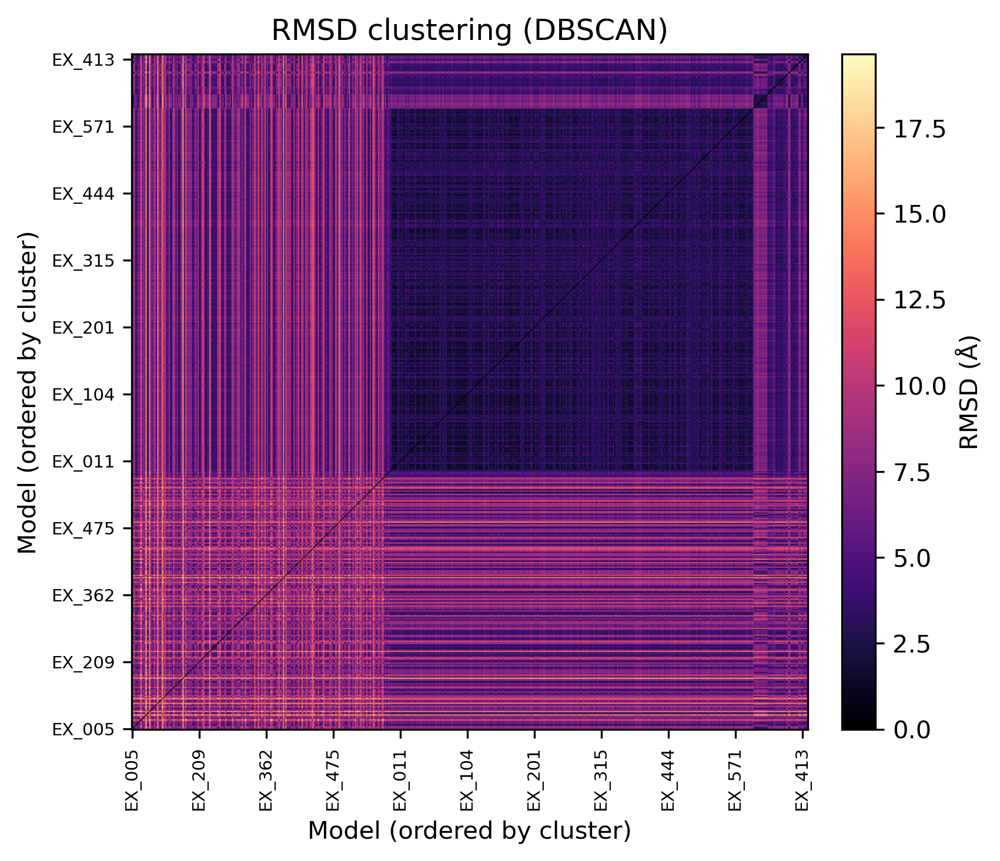

## 构象聚类分析报告
### 简介
- 我们有 585 个 Pyrophosphokinase 构象，要去重、降维，挑出能代表整体的结构，同时保留可能含隐蔽口袋的稀有构象。
- 隐蔽口袋往往只在少数构象出现，所以不能只看数量最多的簇，还要关注差异大的少数构象。

### 方法
- 距离：用 MDTraj 对 PDB 做最优叠合，计算两两 RMSD，得到 585×585 对称矩阵（mdtraj 输出 nm，这里换算成 Å）。
- 聚类：DBSCAN（metric=预计算 RMSD，eps=2.0，min_samples=2）。原因：不用先设簇数，能把稀疏区域标成噪声，方便抓离群点。
- 选代表：
  - 主簇：按簇大小排序，取前 3 个簇，各选簇内总 RMSD 最小的构象（medoid）作为代表。
  - 稀有态：噪声点（-1）和小簇保留给下游 D2 做重点口袋检查。
- 可视化：`rmsd.png`，深色代表相似，亮色代表差异大，按簇顺序重排。

### 结果与讨论
- 聚类统计（共 585 个）：
  - 噪声：224
  - 簇 0：314
  - 簇 1：12
  - 簇 2–15：若干小簇（每簇 2–7 个）
- 代表构象（Top 3 主簇 medoid）：
  - 簇 0：EX_548.pdb（index 534）
  - 簇 1：EX_487.pdb（index 473）
  - 簇 5：EX_260.pdb（index 246）
- 热图解读（见下图）：
  - 左上大块深色：簇 0 的主态，构象高度相似。
  - 中小块深色：簇 1、簇 5 等次要稳态。
  - 零散亮色点/条：噪声和小簇，与主态差异大，优先怀疑有隐蔽口袋。

### 结论与后续
- EX_548、EX_487、EX_260 覆盖主要稳定态，可供 D2 作为基准口袋检测。
- 噪声和小簇是寻找隐蔽口袋的重点，应逐一跑 fpocket/MDpocket/P2Rank，与主簇代表对比开闭变化。
- 同时提供主簇和稀有态，能更全面地覆盖口袋可能的开合状态，减少漏检。 
